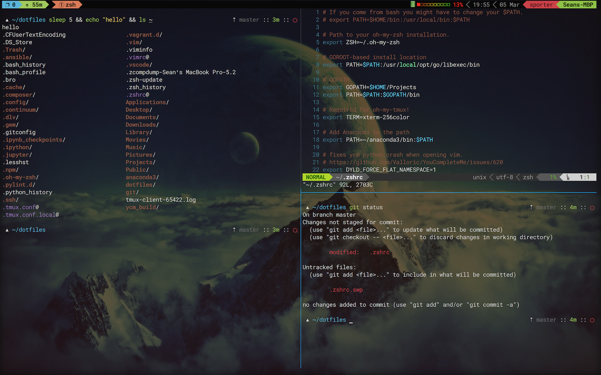

dotfiles
========

A dotfile setup for zsh, vim and tmux. This also includes my iterm2 backup.

Other various bit of this include:
- Base16 iTerm2 with the SetiUI theme for the great text colors: https://github.com/chriskempson/base16-iterm2
- Geometry, for the prompt/nice git branch parts: https://github.com/frmendes/geometry
- zsh-syntax-highlighting, for the (you guessed it) zsh syntax highlighting: https://github.com/zsh-users/zsh-syntax-highlighting
- Airline for the fancy vim status bar: https://github.com/vim-airline/vim-airline
- Roboto Mono for Powerline font: https://github.com/powerline/fonts/tree/master/RobotoMono

setup
--------
Check out dotfiles to your home folder like so:

bspwm.desktop belongs in /usr/share/xsessions. You'll want to install gdm3 if you're using gnome.

```bash
cd ~
git clone --recursive git://github.com/glaaki/dotfiles.git
```

Symlink the files from the repo to your home directory like this:
```bash
ln -sf ~/dotfiles/.vimrc ~/.vimrc
ln -sf ~/dotfiles/.zshrc ~/.zshrc
ln -sf ~/dotfiles/.tmux.conf ~/.tmux.conf
ln -sf ~/dotfiles/.tmux.conf.local ~/.tmux.conf.local
```
If you want to keep some API keys or other secrets out of git, this setup will source a `.extra` file if it exists. I included an example, simply link it like the others and run this git command to stop tracking it:
```bash
ln -sf ~/dotfiles/.extra ~/.extra
git update-index --assume-unchanged .extra
```

When you open Vim for the first time you'll need to run `:PlugInstall` to actually pull down the plugins. Tmux user overrides should go in `.tmux.conf.local` instead of `.tmux.conf`

todo
--------
- theme the vim powerline to match everything else.
- set up an ansible playbook to automate this
  * vim is set up to put swap files in a different directory
  * add command to install vim plug
  * open vim and run :PlugInstall?
  * make sure ~/.vim/swapfiles and ~/.vim/backups folders are created, this setup puts all the swap files in there.
  * install zsh-syntax-highlighting
  * install geometry prompt
  * chsh for using zsh instead of bash

screenshot
--------

